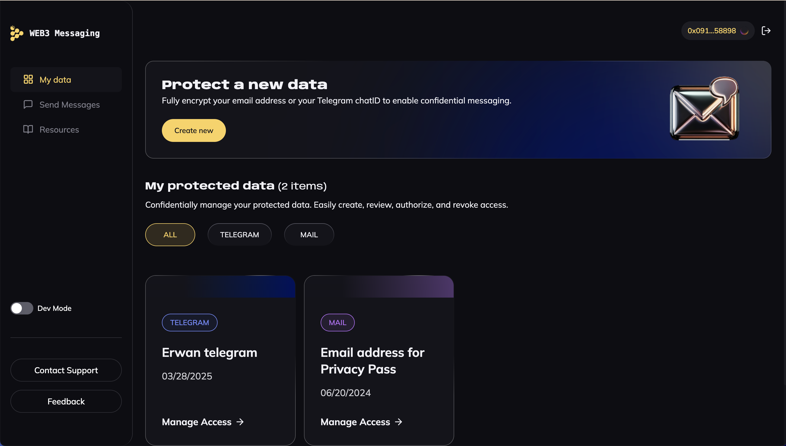

# Web3 Messaging usecase demo



This project is mainly used as a demo of what can be accomplished with iExec [web3mail](https://docs.iex.ec/references/web3mail) and [web3telegram](https://docs.iex.ec/references/web3telegram) SDK

## Main libraries

**TanStack Query** (https://tanstack.com/query/latest/docs/framework/react/overview)

**TailwindCSS** (https://tailwindcss.com/docs/guides/vite#react)  
➕  
**shadcn/ui**  (https://ui.shadcn.com/)

**Reown** (https://reown.com/)

## Prerequisites

Before running this application, make sure you have the following installed:

- [Node.js](https://nodejs.org/) (version 22 or later)

## Quick start

First, clone the repository with the following command:

```bash
git clone https://github.com/iExecBlockchainComputing/web3-messaging-usecase-demo
```

Navigate to the project directory:

```bash
cd web3-messaging-usecase-demo
```

Install the dependencies:

```bash
npm ci
```

Then, you can run the application in development mode:

```bash
npm run dev
```

Open [http://localhost:3000](http://localhost:5173) to view it in the browser. The page will automatically reload if you make changes to the code.
